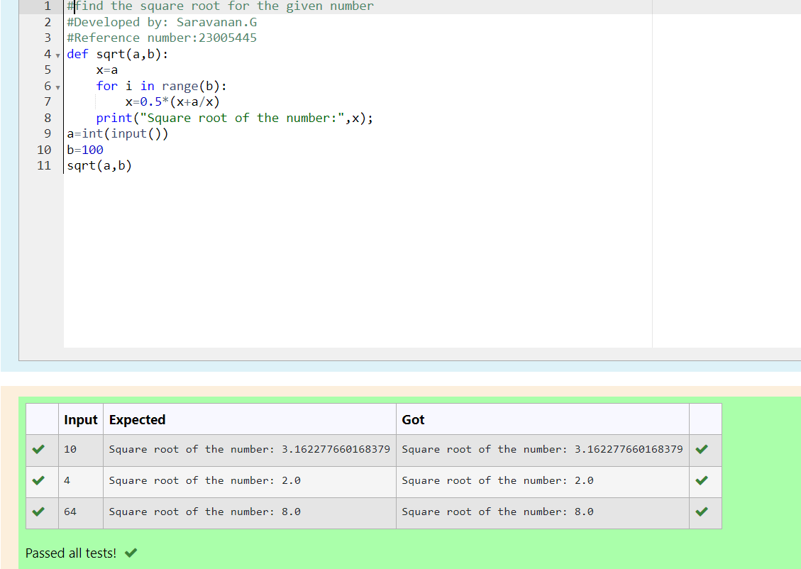

# Find the square root of a number

## AIM:
To write a program to find the square root of a number.

## Equipments Required:
1. Hardware – PCs
2. Anaconda – Python 3.7 Installation / Moodle-Code Runner

## Algorithm
1. Define a function.
2. Assign number_iters = 100 in the function to perform 100 iteratios.
3. Set i = 0.
4. Calculate  number = 0.5 * (number + a / number) for 100 iterations.
5. Return number

## Program:
```

#find the square root for the given number
#Developed by: Saravanan.G
#Reference number:23005445
def sqrt(a,b):
    x=a
    for i in range(b):
        x=0.5*(x+a/x)
    print("Square root of the number:",x);
a=int(input())
b=100
sqrt(a,b)
```


## Output:


## Result:
Thus the program to find the square root for the given number(newton's method) using function is written and verified using python programming.
